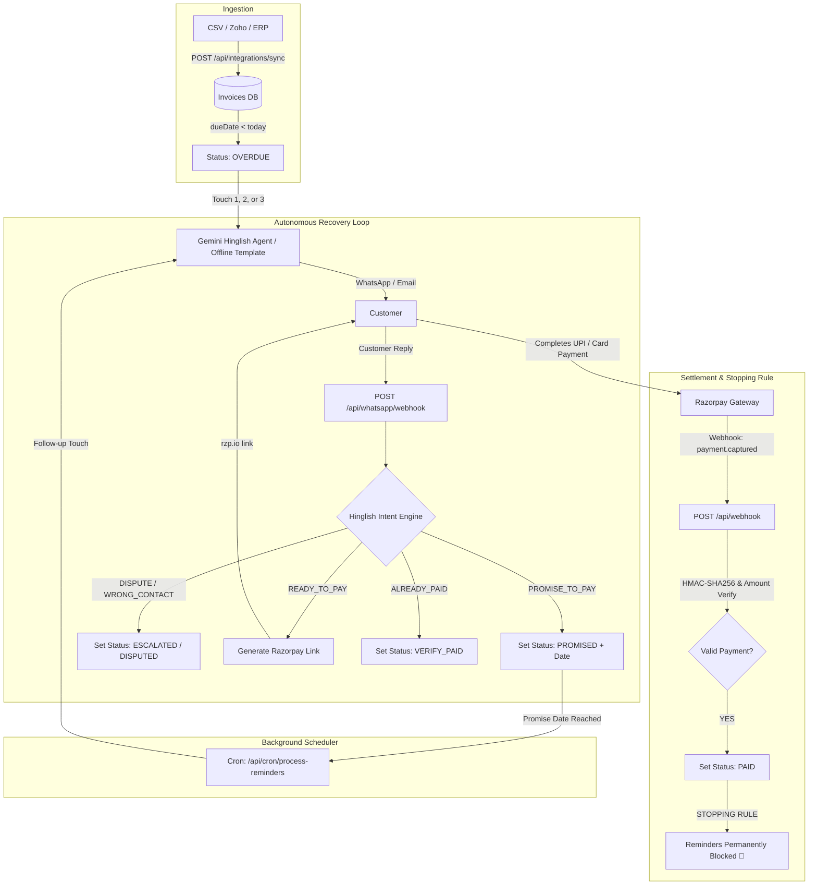

# ⚡ RecoverPay — Autonomous AI B2B Invoice Recovery Agent

> **Polite, culturally nuanced B2B invoice recovery for Indian MSMEs — powered by Gemini AI, deterministic financial guardrails, and instant Razorpay settlement.**

[](https://nextjs.org/)
[](https://react.dev/)
[](https://www.typescriptlang.org/)
[](https://razorpay.com/)
[](https://deepmind.google/technologies/gemini/)
[](https://turso.tech/)

---

## 📌 The MSME Problem

In India, **₹10.7+ Lakh Crore ($130B)** is locked in delayed B2B payments. Indian MSMEs operate on thin margins and face an impossible dilemma:

- ❌ **Aggressive legal notices & debt collection calls** alienate long-term buyers and kill repeat business.
- ❌ **Polite inaction & manual WhatsApp reminders** get ignored, leading to severe working capital crunches.
- ❌ **Generic bulk SMS/Email blasts** feel spammy and lack conversational context.

**RecoverPay solves this through empathetic, culturally calibrated AI negotiation** that speaks the buyer's language, understands payment commitments, and generates instant UPI/card payment links right inside the conversation.

---

## 🌟 Key Features

- 🗣️ **Culturally Nuanced Hinglish Tone:** Speaks Romanized Hindi + English (*"Namaste Sharma ji! 🙏 Bill INV-001 overdue ho gaya hai..."*), calibrated across 3 escalating touchpoints from warm reminder to firm notification.
- 🧠 **Dual-Engine NLP Intent Parser:** Detects commitments (*"Salary 5th ko aayegi"*, *"kal subah transfer karunga"*), disputes (*"goods damaged"*), wrong contacts, or readiness to pay. Operates with Gemini AI and an offline-resilient heuristic rule engine.
- 💳 **Instant Razorpay Payment Links:** When a customer says *"link bhejo"* or *"UPI QR do"*, RecoverPay generates a server-side `rzp.io` checkout link and delivers it immediately in chat.
- 🛡️ **Zero-Hallucination Guardrails:** **The LLM drafts text only.** It never has direct write permissions to the database. All financial status changes, retry counts, and dates are updated deterministically.
- 🛑 **Absolute Stopping Rule:** Once Razorpay confirms payment via webhook, **all automated reminders are instantly cancelled**. Post-payment reminder calls return HTTP 400.
- ⏱️ **Strict 3-Touch Maximum:** Prevents customer harassment. If an invoice remains unresolved after 3 touches, it automatically transitions to `ESCALATED` and routes to a human merchant console.
- 📜 **Immutable Audit Trail:** Every ingest, reminder, inbound parse, webhook capture, and merchant override is timestamped, confidence-scored, and exportable to CSV.

---

## 🔄 End-to-End Architecture



---

## 🛠️ Tech Stack

| Layer | Technologies Used |
| :--- | :--- |
| **Framework** | [Next.js 15.4](https://nextjs.org/) (App Router, Server Components & Route Handlers) |
| **UI & Styling** | [React 19](https://react.dev/), [Tailwind CSS 3.4](https://tailwindcss.com/), [Lucide React](https://lucide.dev/) |
| **AI / NLP** | [Google Gemini 2.0 / 3.x Flash](https://deepmind.google/technologies/gemini/) via `@google/generative-ai` + Deterministic Regex Fallback |
| **Database** | SQLite / [Turso](https://turso.tech/) via `@libsql/client` (Local file fallback or distributed cloud SQLite) |
| **Payments** | [Razorpay](https://razorpay.com/) Payment Links API + HMAC-SHA256 Webhook Verification |
| **Communication** | WhatsApp Webhook interface (Meta Cloud API & Twilio compatible) + Resend Email channel |

---

## 🚀 Quickstart

### Prerequisites
- Node.js 18+ or 20+
- npm, yarn, or pnpm

### 1. Clone & Install
```bash
git clone https://github.com/siddupatel-00/Recoverpay-Buildathon.git
cd Recoverpay-Buildathon
npm install
```

### 2. Environment Setup
Copy the example environment file:
```bash
cp .env.example .env.local
```

Edit `.env.local` with your credentials:
```ini
# AI Engine (Optional: graceful offline Hinglish templates activate if omitted)
GEMINI_API_KEY=AIza_YOUR_GEMINI_KEY

# Razorpay Test / Live Keys (Optional: realistic mock rzp.io links activate if omitted)
RAZORPAY_KEY_ID=rzp_test_YOUR_ID
RAZORPAY_KEY_SECRET=YOUR_SECRET
RAZORPAY_WEBHOOK_SECRET=your_webhook_secret

# Cron Scheduler & App URL
CRON_SECRET=recoverpay-cron-secret
NEXT_PUBLIC_APP_URL=http://localhost:3000

# Turso Cloud DB (Optional: defaults to local file:recoverpay.db)
TURSO_URL=
TURSO_AUTH_TOKEN=
```

### 3. Run Development Server
```bash
npm run dev
```
Open [http://localhost:3000](http://localhost:3000) in your browser.

---

## 🧪 E2E Verification Suite

RecoverPay includes an automated 11-step end-to-end integration test verifying the entire lifecycle:

```bash
# Start the server (if not already running)
npm run dev &

# Execute the test suite
node test-e2e.mjs
```

### What `test-e2e.mjs` Tests:
1. **CSV Ingestion:** Ingests raw overdue invoice records and validates schema.
2. **Deterministic Overdue Classification:** Ensures dates prior to today automatically flag as `OVERDUE` without LLM intervention.
3. **Culturally Nuanced Reminder:** Generates respectful Hinglish reminder copy.
4. **Hinglish Promise Parsing:** Parses natural phrases like *"Salary 5th ko aayegi"* into structured `YYYY-MM-DD` commitments.
5. **Scheduler & Cron:** Verifies matured promises trigger automated follow-ups.
6. **Payment Link Generation:** Creates valid Razorpay checkout links.
7. **Dispute Handling:** Confirms goods disputes halt automated recovery and escalate to human review.
8. **HMAC Webhook Verification:** Verifies signatures and validates that a successful payment triggers the **Stopping Rule** (post-payment reminders return HTTP 400).
9. **Audit Trail Verification:** Ensures all transitions are logged and exportable to CSV.
10. **Ingest Idempotency:** Confirms duplicate invoice numbers are safely skipped.
11. **Multi-Channel Email Fallback:** Verifies secondary email reminder delivery.

---

## 📡 API Reference

| Method | Endpoint | Description |
| :--- | :--- | :--- |
| `POST` | `/api/integrations/sync` | Ingest invoices via CSV, Zoho ERP, or JSON with deterministic overdue detection |
| `GET` | `/api/invoices` | List and filter invoices, message histories, and recovery statistics |
| `POST` | `/api/reminders/send` | Dispatch WhatsApp reminder (Gemini Hinglish draft with 3-touch cap) |
| `POST` | `/api/reminders/send-email` | Dispatch email reminder (Resend API with mock fallback) |
| `POST` | `/api/whatsapp/webhook` | Inbound WhatsApp webhook (Meta Cloud, Twilio, & simulator compatible) |
| `POST` | `/api/payments/create-link` | Generate server-side Razorpay `rzp.io` payment link |
| `POST` | `/api/webhook` | Razorpay HMAC-SHA256 webhook listener with idempotency and stopping rule |
| `POST` | `/api/cron/process-reminders` | Background cron scheduler for matured promises and overdue accounts |
| `POST` | `/api/escalations/resolve` | Human resolution console (mark paid, reset retries, attach audit notes) |
| `GET` | `/api/audit/export` | Download RFC-4180 compliant CSV audit trail |

---

## 🎯 Evaluator & Judge Q&A

<details>
<summary><b>Q: How do you prevent LLM hallucinations from affecting balances or status?</b></summary>

> **Answer:** RecoverPay uses a **strict architectural boundary**. The LLM is only invoked to generate message text and classify intent into defined enums. It has zero database write privileges. Status updates, retry counters, date calculations, and payment validations are 100% deterministic TypeScript logic.
</details>

<details>
<summary><b>Q: How does the system prevent sending reminders after a buyer has paid?</b></summary>

> **Answer:** Through an absolute **Stopping Rule**. The moment a payment is confirmed via Razorpay webhook or manual merchant reconciliation, the invoice status changes to `PAID`. The reminder endpoints (`/api/reminders/send` and `/api/reminders/send-email`) immediately check this status first and return an HTTP 400 error, blocking any outbound communication.
</details>

<details>
<summary><b>Q: Is this ready for real WhatsApp numbers?</b></summary>

> **Answer:** Yes. `/api/whatsapp/webhook` supports the Meta WhatsApp Cloud API payload format (including the `hub.challenge` verification handshake) and Twilio formats. The built-in interactive simulator allows full testing without needing an active WhatsApp Business API account.
</details>

<details>
<summary><b>Q: How are partial payments or underpayment fraud handled?</b></summary>

> **Answer:** The Razorpay webhook handler compares `entity.amount` against the expected invoice amount (`expected = invoice.amount * 100`). Any mismatch is flagged with an `AMOUNT_MISMATCH` audit event and rejected with HTTP 400, preventing unauthorized mark-as-paid exploits.
</details>

---

## 📄 License

Distributed under the MIT License. See `LICENSE` for more information.

---

**Built with ❤️ for Indian MSMEs at the Razorpay Buildathon.**

